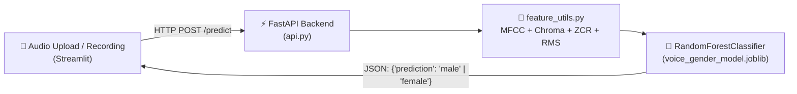

# 🎙️ Voice Gender Classifier

### Detect male / female voice from audio — powered by MFCC + Random Forest


</div>

---

## 📌 Overview

A voice-based **gender classifier** that predicts **Male** or **Female** from a short audio clip.
The project has two parts:

- 🧠 **FastAPI backend** (`api.py`) — loads the trained model and serves `POST /predict`
- 🎨 **Streamlit frontend** (`streamlit_app.py`) — upload or record audio, get an instant prediction

---

## 🧠 Model & Approach

| Component | Choice |
|---|---|
| **Model** | `RandomForestClassifier` (scikit-learn) |
| **Features** | MFCC (mean + std) + Delta-MFCC + Chroma + ZCR + Spectral Centroid + RMS |
| **Feature extraction** | [`librosa`](https://librosa.org/) |
| **Training data** | [RAVDESS](https://zenodo.org/record/1188976) — 24 speakers, English speech |
| **Validation** | Speaker-grouped split (unseen speakers) + 5-fold grouped cross-validation |
| **Held-out accuracy** | ~90% (unseen speakers) · ~93% mean (5-fold CV) |

> [!IMPORTANT]
> **🌍 Works across languages, even though the training data is English.**
> MFCC and the other acoustic features used here (pitch-related spectral shape, formant structure, energy, zero-crossing rate) describe **how a voice physically sounds** — not *what words are being said*. The classifier never looks at language, vocabulary, or transcription; it only looks at the acoustic fingerprint of the voice (things like fundamental frequency and vocal-tract resonance, which differ between typical male and female voices regardless of the language spoken). Because of this, the Random Forest generalizes reasonably well to speakers of **any language**, even though it was only trained on English (RAVDESS) audio. Accuracy may still vary slightly with very different recording conditions (noise, mic quality, whispering, singing, etc.), since those also shift the acoustic features.

---

## 🗂️ Project Structure

```
voice-gender-classification/
├── api.py                    # FastAPI backend  →  POST /predict
├── streamlit_app.py          # Streamlit frontend (upload / record / predict)
├── feature_utils.py          # Shared feature extraction (used by both train & api)
├── train.py                  # Trains the RandomForest model
├── voice_gender_model.joblib # Trained model + scaler + labels
├── test_model.py             # Quick sanity-check script
├── requirements.txt
└── README.md
```

---

## ⚙️ How It Works



---

## 🚀 Run Locally (VS Code)

**1. Open the project folder in Visual Studio Code.**

**2. Install the required scikit-learn version** (must match the version the model was trained/saved with):

```bash
python -m pip install scikit-learn==1.8.0
```

> If it's your first time running the project, also install the rest of the dependencies:
> ```bash
> pip install -r requirements.txt
> ```

**3. Start the backend server** (in the VS Code terminal):

```bash
uvicorn api:app --reload
```

Leave it running — it serves the API at `http://localhost:8000`.

**4. Close that terminal (or open a new one) and start the frontend:**

```bash
streamlit run streamlit_app.py
```

**5. That's it 🎉** — Streamlit will open in your browser. Upload or record a voice clip, hit **Predict**, and see the result.

---

## 🔌 API Reference

**`POST /predict`**

| | |
|---|---|
| **Input** | `multipart/form-data`, field `file` = a `.wav` audio file |
| **Output** | `{"prediction": "male"}` or `{"prediction": "female"}` |

```bash
curl -X POST "http://localhost:8000/predict" -F "file=@sample.wav"
```

---

## 🛠️ Tech Stack

<div align="center">


</div>

---

<div align="center">
Made with 🎙️ + 🌲 RandomForest
</div>
